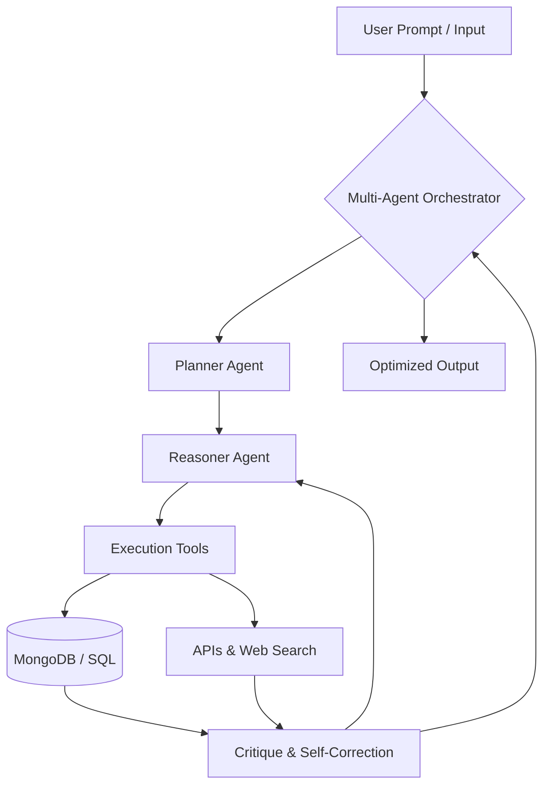

<div align="center">

<!-- Premium Header Waving Banner -->


<br/>

<!-- Animated Title Typing SVG -->
<h1 align="center">
  
</h1>

### 💡 Crafting Web Experiences • Building AI Agents • Exploring Future Tech – from India 🇮🇳

<br/>

<!-- Premium Contact & Social Badges -->
<p align="center">
  <a href="mailto:jeevankadam2275@gmail.com">
    
  </a>
  <a href="https://www.linkedin.com/in/jeevan-kadam-730b87327/" target="_blank">
    
  </a>
  <a href="https://leetcode.com/u/jeevan-2275/" target="_blank">
    
  </a>
  <a href="https://github.com/Jeevan-2275" target="_blank">
    
  </a>
</p>

</div>

<br/>

---

## 💫 About Me


```javascript
const jeevan = {
    location: "Ahmedabad, Gujarat, India",
    focus: "Full-Stack Web & AI Agent Engineering",
    currentFocus: "Scalable Web Architectures & Intelligent Workflows",
    
    expertise: {
        frontend: ["React.js", "Vite", "Tailwind CSS", "HTML5/CSS3"],
        backend: ["Node.js", "Express.js", "Firebase API"],
        databases: ["MongoDB", "SQL"],
        cloudTools: ["AWS", "GCP", "Docker/DevOps", "Git"]
    },
    
    currentlyLearning: ["Agentic AI Design Patterns", "Advanced MERN Stack", "System Design"],
    lifePhilosophy: "Bridge intelligent technology and human-centric UI",
    
    askMeAbout: [
        "Full-stack MERN systems",
        "Clean UI/UX practices",
        "AI Agent automation",
        "Database optimizations"
    ]
};
```

<br clear="right"/>

---

## ⚡ What I Build

<div align="center">

<table width="100%">
<tr>

<!-- Frontend Magic -->
<td align="center" width="25%" valign="top">
  
  <br/><strong>Frontend Magic</strong>
  <br/><br/><sub>React • Tailwind CSS</sub>
  <br/><sub>Vite • HTML5 • CSS3</sub>
</td>

<!-- Backend Power -->
<td align="center" width="25%" valign="top">
  
  <br/><strong>Backend Power</strong>
  <br/><br/><sub>Node.js • Express.js</sub>
  <br/><sub>RESTful APIs • SQL</sub>
</td>

<!-- AI Agents -->
<td align="center" width="25%" valign="top">
  
  <br/><strong>AI & Automation</strong>
  <br/><br/><sub>Agentic Workflows</sub>
  <br/><sub>Intelligent Automations</sub>
</td>

<!-- Cloud & DevOps -->
<td align="center" width="25%" valign="top">
  
  <br/><strong>Cloud & Tools</strong>
  <br/><br/><sub>AWS • GCP • Docker</sub>
  <br/><sub>Git • System Design</sub>
</td>

</tr>
</table>

</div>

<br/>


<br/>

## 🧠 Featured Agentic AI Architecture

As an **AI Agent Engineer**, I build autonomous, multi-agent systems designed to perform reasoning, tool execution, and self-correction. Below is the structural architectural flow representing my custom Agentic implementations:



<br/>


<br/>

## 🚀 Featured Projects

<div align="center">

<table width="100%">
<tr>
<td width="50%" valign="top" style="padding: 10px;">

<div align="center">

### 🔨 Noble's Bid


**Real-time online MERN auction platform**

<p align="left" style="font-size: 0.9em; min-height: 110px; margin-top: 10px;">
✨ Real-time online bidding & auction automation<br/>
✨ Role-based access control & JWT authentication<br/>
✨ Scalable backend APIs & secure payment verification<br/>
✨ Full admin dashboards & auto email notifications
</p>

<p align="center">
  
  
  
  
  
</p>

<br/>

<a href="https://github.com/Jeevan-2275/noble_bids" target="_blank">
  
</a>
<a href="https://noblebids2275.netlify.app" target="_blank">
  
</a>

</div>

</td>
<td width="50%" valign="top" style="padding: 10px;">

<div align="center">

### 📈 Growwise


**Real-time stock market analytics tracker**

<p align="left" style="font-size: 0.9em; min-height: 110px; margin-top: 10px;">
✨ Next.js stock prices tracking & charts<br/>
✨ Personalized watchlists & smart custom alerts<br/>
✨ AI-powered insights & financial summaries<br/>
✨ High-speed automated workflows via Inngest
</p>

<p align="center">
  
  
  
  
  
</p>

<br/>

<a href="https://github.com/Jeevan-2275/Growwise" target="_blank">
  
</a>
<a href="https://stock-market-2275.vercel.app/sign-in" target="_blank">
  
</a>

</div>

</td>
</tr>

<tr>
<td width="50%" valign="top" style="padding: 10px;">

<div align="center">

### 🕹️ CyberDash


**React Native infinite runner mobile game**

<p align="left" style="font-size: 0.9em; min-height: 110px; margin-top: 10px;">
✨ Infinite runner core mechanics & power-ups<br/>
✨ Level-based progressions & collision physics<br/>
✨ Responsive cross-device gameplay optimizations<br/>
✨ Expo Go build Android APK deployments
</p>

<p align="center">
  
  
  
  
</p>

<br/>

<a href="https://github.com/Jeevan-2275/cyber-dash" target="_blank">
  
</a>

</div>

</td>
<td width="50%" valign="top" style="padding: 10px;">

<div align="center">

### 🤝 FocusFuze (Open Source)


**Video note-taking collaboration contribution**

<p align="left" style="font-size: 0.9em; min-height: 110px; margin-top: 10px;">
✨ Video note-taking module enhancement<br/>
✨ Advanced module search, sorting & filtering<br/>
✨ Refined UI note management templates & stylesheets<br/>
✨ Greatly improved usability & note workspace flow
</p>

<p align="center">
  
  
  
  
</p>

<br/>

<a href="https://github.com/Jeevan-2275/focus_fuze" target="_blank">
  
</a>
<a href="https://focusfuze.netlify.app" target="_blank">
  
</a>

</div>

</td>
</tr>

<tr>
<td colspan="2" valign="top" style="padding: 15px;">

<div align="center">

### 🎯 Agentic AI Architectures (Coming Soon)


**Building autonomous intelligent ecosystems**

<p align="center" style="font-size: 0.95em; max-width: 650px; margin-top: 10px;">
✨ Multi-agent collaborative workflows designed for complex problem-solving<br/>
✨ Secure integration pipelines and live data telemetry<br/>
✨ Optimized self-improving prompt evaluation and feedback architectures
</p>

<p align="center">
  
  
  
</p>

</div>

</td>
</tr>
</table>

</div>

<br/>


<br/>

## 🛠️ Technology Arsenal

<div align="center">

### Frontend Development

<br/>
<sub>React.js • Next.js • Tailwind CSS • Material UI • ShadCN UI • Redux Toolkit</sub>

<br/><br/>

### Backend Development & Databases

<br/>
<sub>Node.js • Express.js • MongoDB • PostgreSQL • MySQL • Redis • Firebase</sub>

<br/><br/>

### Mobile Development

<br/>
<sub>React Native • Expo • AsyncStorage • Expo Go</sub>

<br/><br/>

### AI & Automation
<p align="center">
  
  
  
  
</p>

<br/>

### Tools & Platforms

<br/>
<sub>Git • GitHub • VS Code • Figma • Vercel • Netlify • Render</sub>

<br/><br/>

### Programming Languages


<br/><br/>

### Currently Learning & DevOps


<br/><br/>

### Core & Authentication
<p align="center">
  
  
  
  
  
</p>

</div>

<br/>


<br/>

## 📊 GitHub & Performance Analytics

<div align="center">

### 📊 GitHub Status & Streak

<table width="100%">
  <tr>
    <td width="50%">
      
    </td>
    <td width="50%">
      
    </td>
  </tr>
</table>

<br/>

### 📊 Contribution Graph

<br/>

<!-- Pacman Contribution Animation -->


<br/>
### 📈 GitHub Profile Analytics

<a href="https://github.com/Jeevan-2275" target="_blank">
  
</a>

<p align="center">
  <a href="https://github.com/Jeevan-2275" target="_blank">
    
  </a>
  <a href="https://github.com/Jeevan-2275" target="_blank">
    
  </a>
</p>

<p align="center">
  <a href="https://leetcode.com/u/jeevan-2275/" target="_blank">
    
  </a>
</p>

</div>

<br/>

<br/>

## 🤝 Let's Connect & Collaborate

<div align="center">

<table width="100%" style="border-collapse: collapse; border: none; background-color: #0d1117; border-radius: 12px; box-shadow: 0 4px 30px rgba(0,0,0,0.15);">
  <tr style="border: none;">
    <!-- Left Column: Visual & Freelance Status -->
    <td width="35%" align="center" valign="middle" style="border: none; padding: 25px 15px; border-right: 1px dashed #7C3AED; background: #070a13; border-top-left-radius: 12px; border-bottom-left-radius: 12px;">
      
      <br/>
      <p style="font-size: 0.9em; margin-bottom: 12px; font-weight: bold; color: #10B981;">🟢 Available for Projects</p>
      <a href="mailto:jeevankadam2275@gmail.com" target="_blank">
        
      </a>
      <br/><br/>
      <a href="https://jeevanportfolio2275.netlify.app/" target="_blank">
        
      </a>
    </td>
    <!-- Right Column: Collaboration Channels & Badges -->
    <td width="65%" valign="top" style="border: none; padding: 20px 20px 20px 25px; background: #0d1117; border-top-right-radius: 12px; border-bottom-right-radius: 12px;">
      <h3 align="left" style="color: #7C3AED; border: none; margin-bottom: 10px;">🌟 Let's Connect & Collaborate</h3>
      <p align="left" style="color: #8b949e; font-size: 0.95em; line-height: 1.5; margin-bottom: 15px;">
        Have an exciting project idea, looking for a full-stack MERN solution, or want to discuss multi-agent AI architectures? Let's connect! I am actively open to freelance, open-source, and technical roles.
      </p>
      <h4 align="left" style="color: #c9d1d9; margin-bottom: 8px;">💬 Collaborative Specialties:</h4>
      <div align="left" style="margin-bottom: 20px;">
        <span style="display: inline-block; margin: 3px;"></span>
        <span style="display: inline-block; margin: 3px;"></span>
        <span style="display: inline-block; margin: 3px;"></span>
        <span style="display: inline-block; margin: 3px;"></span>
        <span style="display: inline-block; margin: 3px;"></span>
      </div>
      <h4 align="left" style="color: #c9d1d9; margin-bottom: 8px;">📬 Reach Me Directly:</h4>
      <p align="left">
        <a href="mailto:jeevankadam2275@gmail.com">
          
        </a>
        <a href="https://www.linkedin.com/in/jeevan-kadam-730b87327/" target="_blank">
          
        </a>
        <a href="https://leetcode.com/u/jeevan-2275/" target="_blank">
          
        </a>
        <a href="https://jeevanportfolio2275.netlify.app/" target="_blank">
          
        </a>
      </p>
    </td>
  </tr>
</table>

**⚡ Fun Fact:** *I talk to my code more than I talk to people... and sometimes it actually talks back! 🤖😆*

</div>

<br/>

---

<div align="center">

### 💭 Developer Quote

> *"Talk is cheap. Show me the code."* — **Linus Torvalds**

<br/><br/>

### 🌟 Philosophy
*"Building scalable MERN architectures and intelligent agentic ecosystems that bridge sophisticated backend algorithms with flawless, human-centric user experiences."*

<br/>

<!-- Waving Footer Gradient Banner -->


<br/>

**Thanks for visiting! Let's build something amazing together! 🚀**

</div>
